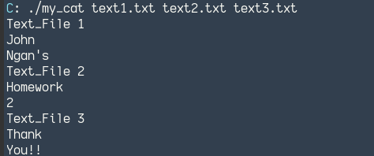
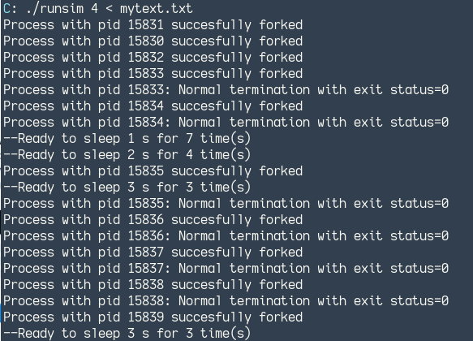

# System Programming

## Choosing C language 

I have decided to choose C language as one of the language for this lab. Specifically, learning system programming.

### my_cat.c: stimulates the cat linux command

 

### The goal of runsim.c was to learn how a process can create and wait upon child processes through:

* Interact with process-related system calls (fork(), the exec() family, and the wait() family)

* Properly check if a system call or a function results in an error 

* Handle sp[ecial cases such as: a child program whose command is longer than the storing buffer, empty lines, etc.

* Spawn and wait upon all the children to terminate, and print the termination cause of each child (4 possibilities: normal termination, killed, stopped, and continued)

