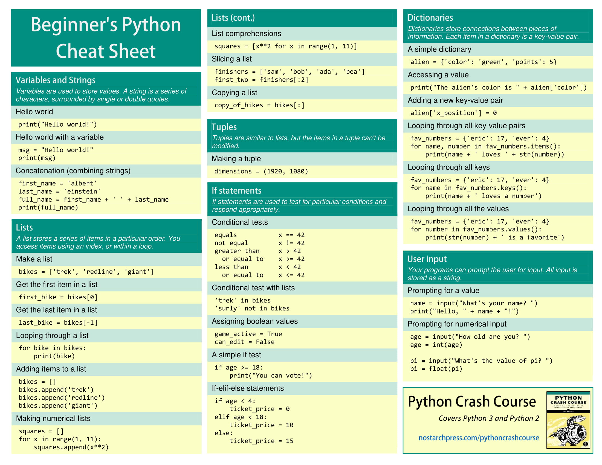

# Python

## Choosing Python

I've decided to choose python as my second language for lab4. The reason because, python syntax to me   is easy to learn, it has large libraries and toolkits, it can integrate with other languages such as C and C++. 

# EP - Euler's Problem

In euler's second problem, I was given a problem where I used one of python's data structure which is "tuple". A tuple is a immutable container. 

In line 15: a, b = b, a+b was used to re-assign a and b for the problem.

From java perspective to solve this problem a placeholder will need to be assign for a+b in order to re-assign it back to b.  
In contrast to python we can create the tuple (b, a+b) and then unpack it back into a and b. 

# Algorithms
The first directory label "algo" is a bunch of common algorithms imported from geeksforgeeks

# Cheat Sheet

